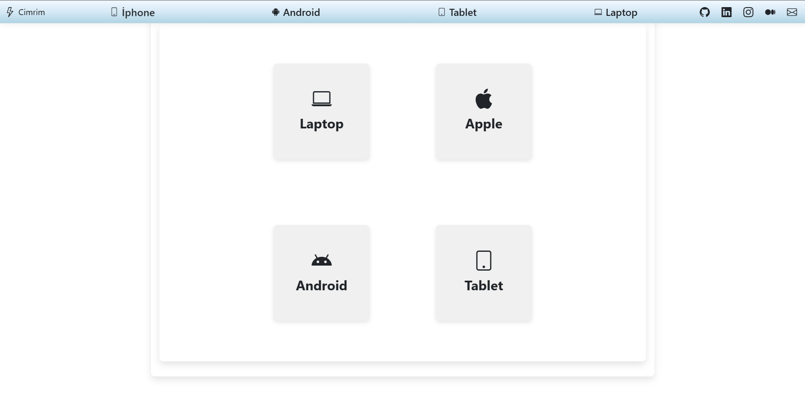
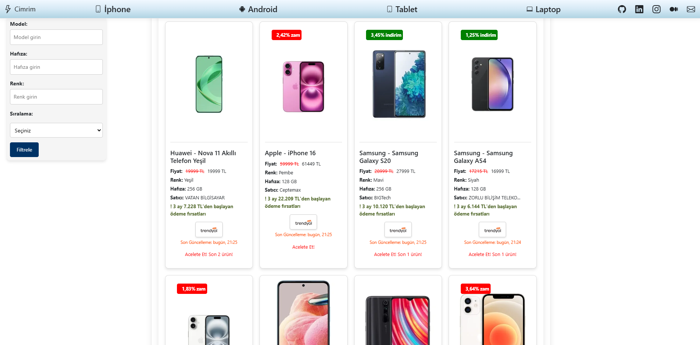
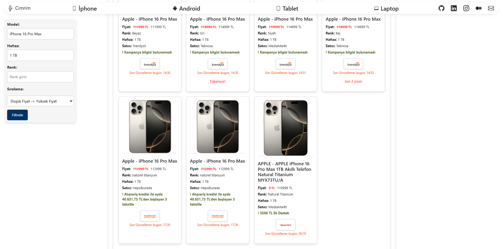
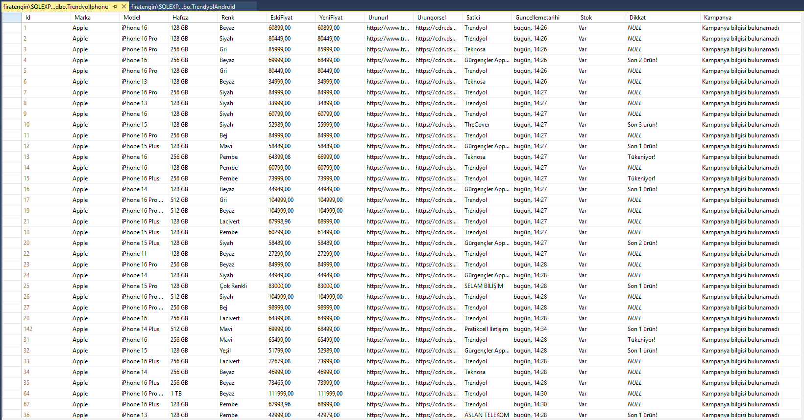

# Trendyol Ürün Bilgisi Çekme ve Dinamik Web Uygulaması

Bu proje, **Trendyol** platformundan ürün bilgilerini çekerek veritabanına güncelleyen bir Python scripti ve bu verileri dinamik olarak ASP.NET MVC framework'ü ile görüntüleyen bir web uygulaması içerir. Proje; telefon, tablet, laptop, iPhone ve diğer elektronik ürünlerin stok, fiyat, kampanya ve marka gibi bilgilerini otomatik olarak alır ve veritabanına işler.

## 🚀 Proje Özellikleri

1. **Web Scraping**: Python ve Selenium kullanılarak Trendyol üzerindeki ürünlerin bilgileri otomatik olarak çekilir.
   - Ürün fiyatı
   - Stok durumu
   - Satıcı bilgisi
   - Renk ve model gibi özellikler
   - Kampanya bilgileri

2. **Veritabanı Yönetimi**: Çekilen bilgiler Microsoft SQL Server'a kaydedilir ve güncellenir.
   - `TrendyolIphone` tablosu örneği ile çalışmaktadır.
   - Stok durumu "Yok" olan ürünlerde alternatif satıcı bilgileri alınır.

3. **Dinamik Web Arayüzü**: ASP.NET MVC ile veriler dinamik olarak görselleştirilir. Kullanıcılar, çekilen bilgileri güncel olarak görüntüleyebilir.

4. **Zaman Yönetimi**: Veriler, en son güncelleme tarihine göre düzenlenir.

## 🛠️ Kullanılan Teknolojiler

- **Backend**:
  - Python
  - Selenium
  - pyodbc
  - Microsoft SQL Server

- **Frontend**:
  - ASP.NET MVC
  - HTML/CSS

- **Veritabanı**:
  - SQL Server (dbo.TrendyolIphone tablosu)

## 📂 Dosya Yapısı

- **`data_scraper.py`**: Trendyol'dan ürün bilgilerini çeken ve veritabanına aktaran Python scripti.
- **ASP.NET MVC Uygulaması**: SQL Server'daki bilgileri kullanıcı dostu bir arayüzde sunar.
   
   
   
  
## 💡 Çalıştırma Adımları

1. **Python Scriptini Çalıştırma**:
   - `chromedriver.exe` dosyasını indirip yolunu script içinde belirtin.
   - `pyodbc` ve `selenium` kütüphanelerini kurun:
     ```bash
     pip install selenium pyodbc
     ```
   - SQL Server bağlantı bilgilerini `conn_str` değişkeninde güncelleyin.
   - Scripti çalıştırarak verileri çekin:
     ```bash
     python data_scraper.py
     ```

2. **ASP.NET MVC Projesini Çalıştırma**:
   - Visual Studio'da projeyi açın.
   - SQL Server bağlantı ayarlarını `web.config` dosyasından güncelleyin.
   - Uygulamayı çalıştırın ve ürün bilgilerini görüntüleyin.


- **E-posta**: [fengin7321@gmail.com](mailto:fengin7321@gmail.com)
- **LinkedIn**: [Fırat Engin](https://www.linkedin.com/in/firatengin404/)

---

Bu proje, hem web scraping hem de dinamik web geliştirme alanında bir örnek teşkil etmektedir. Kullanıcıların e-ticaret verilerini daha etkili bir şekilde yönetmelerine yardımcı olmayı hedefler.
